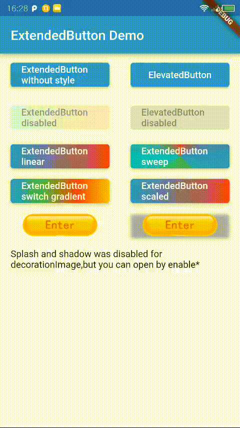

ExtendedButton
===================================
<a href="https://pub.dev/packages/shirne_dialog">
    
</a>

A wrapper of ElevatedButton to support gradient background and transform and image background.

## Features

- ✅ Gradient background
- ✅ DecorationImage background
- ✅ Transform
- ✅ Custom Duration
- ✅ Custom Curve

## Preview

|ExtendedButton| |
|:-:|:-:|
|| |

## Getting started

`flutter pub add extended_icon_button`

## Usage

```dart
ExtendedButton(
    onPressed: () {},
    extendedStyle: ExtendedButtonStyle(
        gradient: MaterialStateProperty.all(const LinearGradient(
            colors: [Colors.blue, Colors.red])),
    ),
    child: const Text('Button'),
);
```

More usage see `/example` folder.

## Additional information

TODO: Tell users more about the package: where to find more information, how to
contribute to the package, how to file issues, what response they can expect
from the package authors, and more.
