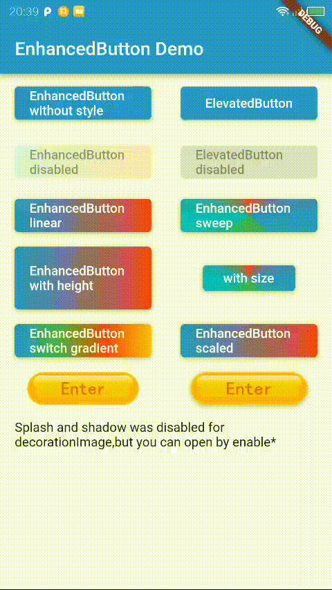

EnhancedButton
===================================
<a href="https://pub.dev/packages/enhanced_button">
    
</a>

A wrapper of ElevatedButton to support gradient background and transform and image background.

## Features

- ✅ Gradient background
- ✅ DecorationImage background
- ✅ Transform
- ✅ Custom Duration
- ✅ Custom Curve

## Preview

|EnhancedButton| |
|:-:|:-:|
|| |

## Getting started

`flutter pub add enhanced_button`

## Usage

```dart
EnhancedButton(
    onPressed: () {},
    enhancedStyle: EnhancedButtonStyle(
        gradient: MaterialStateProperty.all(const LinearGradient(
            colors: [Colors.blue, Colors.red])),
    ),
    child: const Text('Button'),
);
```

More usage see `/example` folder.

## Additional information


